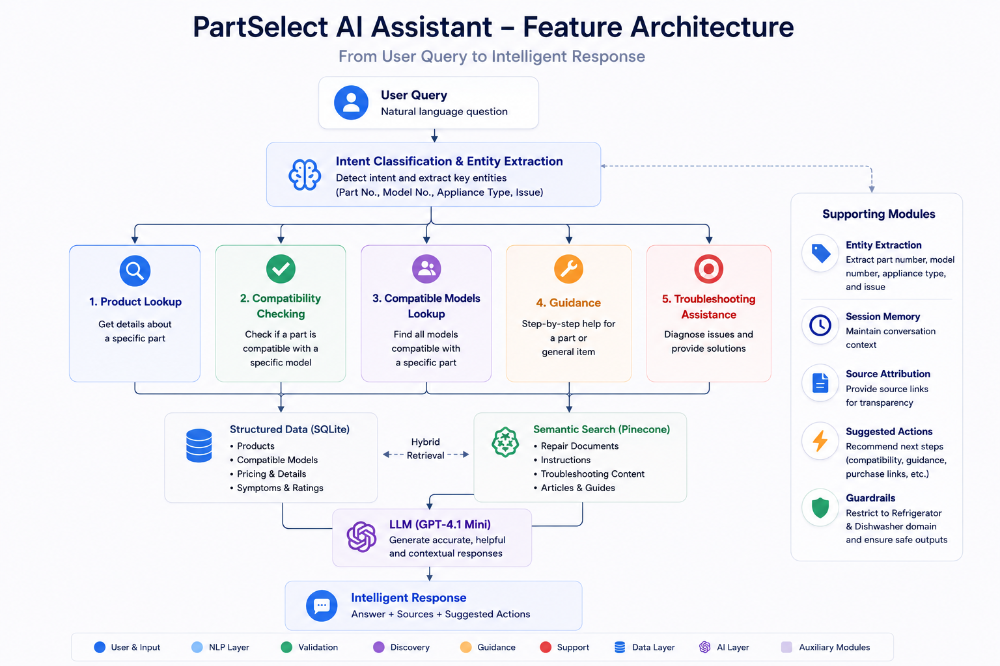

# PartSelect AI Assistant — Backend

Backend service for the Instalily AI Case Study focused on Refrigerator and Dishwasher part support using:

* Product lookup
* Compatibility checks
* Installation guidance
* Troubleshooting assistance
* Retrieval-Augmented Generation (RAG)

The backend combines:

* Structured product data in SQLite
* Semantic repair search using Pinecone
* OpenAI LLMs for reasoning and response generation
* FastAPI REST APIs

---

# Tech Stack
<!-- 
## Tech Stack -->

| Layer             | Technology                         |
| ----------------- | ---------------------------------- |
| Frontend          | **React.js**                       |
| Backend Framework | **FastAPI**                        |
| Language          | **Python 3.11+**                   |
| Database          | **SQLite**                         |
| Vector Database   | **Pinecone**                       |
| Embeddings Model  | **OpenAI text-embedding-3-small**  |
| LLM               | **OpenAI GPT-4.1 Mini**            |
| Data Processing   | **JSONL + Selenium**               |
| API Server        | **Uvicorn**                        |
| Styling           | **Custom CSS (Apple-inspired UI)** |
| Hosting           | **Local / AWS EC2 / Render**       |


---

# Project Structure

```bash
backend/
├── app/
│   ├── main.py
│   ├── config.py
│   ├── llm.py
│   ├── router.py
│   ├── schemas.py
|   ├── memory.py
│   │
│   └── services/
│       ├── sqlite_service.py
│       ├── pinecone_service.py
│       └── agent_service.py
│
├── scripts/
│   ├── ingest_sqlite.py
│   ├── ingest_pinecone.py
│   ├── test_env.py
│   ├── test_compatibility.py
│   ├── test_openai.py
│   ├── test_sqlite.py
│   ├── test_pinecone.py
│   └── reset_data.py
│
├── data/
│   ├── parts1/
│   ├── blog_data/
│   ├── repair_data/
│   └── storage/
|
├── scrappers/
|
├── requirements.txt
└── README.md
```

---

# Prerequisites

Before starting, make sure you have:

* Python 3.11+
* OpenAI API Key
* Pinecone API Key
* Git
* Virtual environment support

---

# Step 1 — Clone and Setup Environment

## Clone Repository

```bash
git clone <your-repository-url>
cd backend
git clone https://github.com/vigneshwaranR1812/Instalily-Case-Study.git
cd instalily-case-study/backend
```

---

## Create Virtual Environment

### Windows

```bash
python -m venv venv
venv\Scripts\activate
```

### Mac/Linux

```bash
python -m venv venv
source venv/bin/activate
```

---

## Install Dependencies

```bash
pip install -r requirements.txt
```

---

# Step 2 — Data Preparation (Scraping & JSONL Files)

The backend uses scraped PartSelect product and repair documentation data.

---

## Product Data

 All data comes from **PartSelect product pages** and **PartSelect blog articles**, scraped using the scripts inside:

    backend/scrapers/
    ├─ blog_scraper.py
    ├─ repair_scraper.py
    |─ parts_scraper_1.py
    |- parts_scraper_2.py
    └─ enrich_products_3.py

    We run these in order of above.

    These then make three JSONL files which we use as base data stores

    1. data/blog_data/filtered_articles.jsonl  (all blogs)
    2. data/repair_data/repairs.jsonl (all symptoms and fixes)
    3. parts1/enriched/product_details_with_main_image.jsonl (product details enriched with image and crossreferences)

    These will be pushed into SQLite and Pinecone
---

# Step 3 — Setup SQLite and Pinecone

## Step 3.1 — Create SQLite Database

Run:

```bash
python scripts/ingest_sqlite.py
```

This creates:

```bash
data/storage/partselect.db
```

---

## SQLite Tables

### products

Stores:

* Part numbers
* Product metadata
* Pricing
* Availability
* Symptoms
* Ratings
* Product images
* Installation information

---

### compatible_models

Stores:

* Appliance compatibility
* Brand information
* Appliance model numbers
* Appliance descriptions
* Model URLs

---

## Step 3.2 — Create Pinecone Index

Create a Pinecone index using:

| Setting         | Value                  |
| --------------- | ---------------------- |
| Metric          | cosine                 |
| Dimensions      | 1536                   |
| Embedding Model | text-embedding-3-small |

---

## Step 3.3 — Ingest Data into Pinecone

Run:

```bash
python scripts/ingest_pinecone.py
```

This process:

* Generates embeddings using OpenAI
* Uploads repair and blog documents to Pinecone
* Enables semantic search for troubleshooting and installation guidance

---

# Step 4 — Environment Variables

Create a `.env` file in the backend root directory:

```env
OPENAI_API_KEY=your_openai_api_key
OPENAI_MODEL=your_openai_model
PINECONE_API_KEY=your_pinecone_api_key
PINECONE_INDEX=partselect-agent
```

---

# Step 5 — Run the FastAPI Server

Start the backend server:

```bash
uvicorn app.main:app --reload --port 8000
```

Server runs at:

```bash
http://127.0.0.1:8000
```

---

# API Example

## POST `/chat`

### Request

```json
{
  "message": "Is part PS11752778 compatible with WDT780SAEM1?",
  "session_id": "test-session"
}
```

---

### Response

```json
{
  "answer": "Yes, part PS11752778 is compatible with model WDT780SAEM1.",
  "intent": "compatibility",
  "products": [],
  "sources": [],
  "suggested_actions": [],
  "needs_model_number": false
}
```

---

# Supported Features



## Product Lookup

Example:

```text
Tell me about part PS11756150
```

---

## Compatibility Checking

Example:

```text
Is PS11752778 compatible with WDT780SAEM1?
```

---

## Compatible Models Lookup

Example:

```text
Show compatible models for PS11752778
```

---

## Installation Guidance

### Product specific
Example:

```text
How to install PS11756150?
```
### General Query
Example:

```text
How to install Dishwasher Upper Rack Adjuster?
```
---

## Troubleshooting Assistance
### Product specific
Example:

```text
PS11756150 is not working
```
### General Query
Example:

```text
Dishwasher rack not sliding properly
```

---


# Notes

## SQLite

Used for:

* Exact product lookup
* Compatibility checks
* Structured product metadata

---

## Pinecone

Used for:

* Semantic repair search
* Installation guidance retrieval
* Troubleshooting retrieval
* RAG context generation

---

## OpenAI LLM Layer

Responsible for:

* Intent classification
* Entity extraction
* Context-aware response generation
* Conversational repair assistance

---

* The assistant is intentionally restricted to:

  * Refrigerators
  * Dishwashers
  * Appliance parts and repair support

* Responses outside the supported scope are rejected.

* SQLite handles structured product data while Pinecone handles semantic retrieval for repair documentation.
